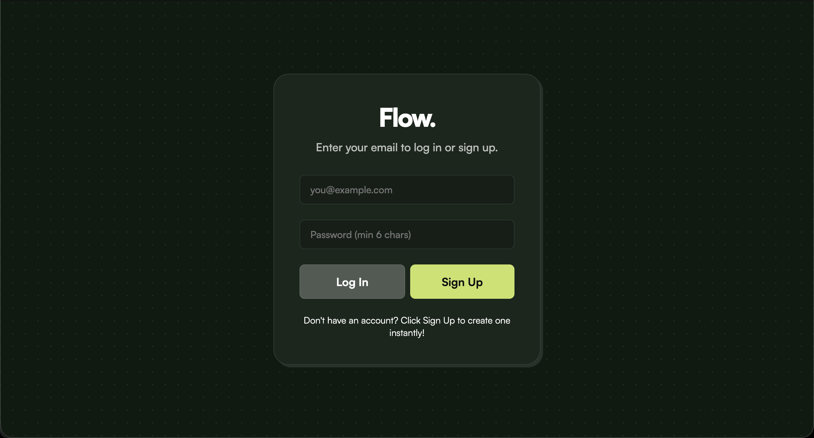
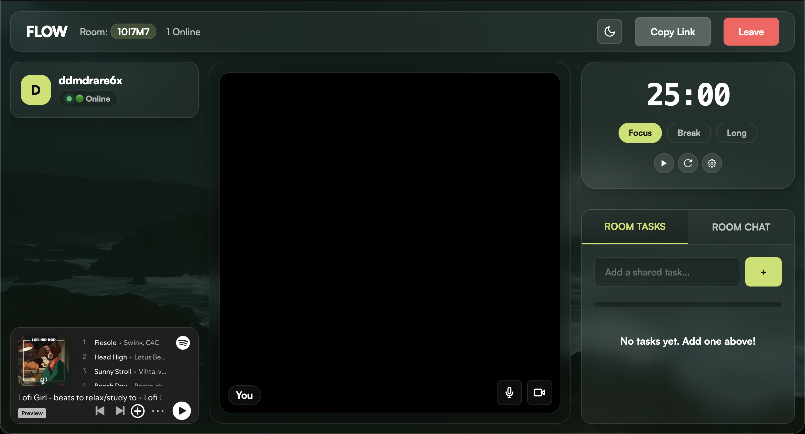

<div align="center">
  

  <h3>A highly scalable, neo-brutalist virtual study space built for extreme focus.</h3>
  
  <p>
    <a href="#features"><strong>Explore Features</strong></a> ·
    <a href="#tech-stack"><strong>Tech Stack</strong></a> ·
    <a href="#getting-started"><strong>Getting Started</strong></a>
  </p>

  <p>
    
    
    
  </p>
</div>

---

## The Vision

**Flow.** is not just a pomodoro timer. It is a fully decentralized, real-time virtual study room designed to connect students across the globe. Built on a massively scalable serverless architecture, Flow eliminates backend bottlenecks, allowing millions of users to study together simultaneously.

The UI employs a beautiful, high-contrast **Neo-Brutalist** aesthetic, making the tools feel tactile, responsive, and visually distinct.

---

## Features

- **P2P Serverless Rooms:** Join instantly using a 6-character room code. No heavy WebSockets to crash the server—all states sync via Supabase Realtime Edge nodes.
- **WebRTC Video:** See your study partners in real-time. Built with pure WebRTC, the video feeds route directly peer-to-peer for zero-latency connection.
- **Synchronized Pomodoro:** A synchronized focus timer that updates seamlessly for everyone in the room. If one person pauses, everyone pauses. 
- **Integrated AI Assistant:** Stuck on a problem? Type `/ai` in the room chat, and Groq's high-speed AI will instantly respond to everyone in the room with the answer.
- **Real-Time Task Management:** Add shared goals. When a task is checked off, the progress bar updates live on everyone's screen, backed persistently by PostgreSQL.
- **Spotify Integration:** Built-in Lo-Fi beats to keep the deep focus going.

---

## Screenshots

| Login | Focus Room |
| :---: | :---: |
|  |  |

---

## Tech Stack

Flow leverages a bleeding-edge, lightweight stack for maximum performance and zero infrastructure cost.

**Frontend:**
- HTML5 / Vanilla CSS (Neo-Brutalist Design System)
- Vanilla JavaScript (ES6 Modules)
- WebRTC (P2P Video & Audio Signaling)

**Backend / Infrastructure:**
- **Node.js & Express:** Ultra-lightweight static file server & AI secure endpoint.
- **Supabase Realtime:** Phoenix/Elixir edge nodes for millisecond-latency state syncing.
- **Supabase PostgreSQL:** Persistent storage for user profiles and shared tasks.
- **Groq AI:** Llama 3 model for the integrated high-speed study assistant.

---

## Getting Started

Want to run Flow locally or deploy it yourself?

### Prerequisites
- Node.js installed
- A [Supabase](https://supabase.com/) project (Free Tier)
- A [Groq](https://console.groq.com/) API Key

### Installation

1. **Clone the repository:**
   ```bash
   git clone https://github.com/ManasDasri/Flow-study.git
   cd Flow-study
   ```

2. **Install dependencies:**
   ```bash
   npm install
   ```

3. **Set up environment variables:**
   Create a `.env` file in the root directory and add your Groq API Key:
   ```env
   GROQ_API_KEY=your_groq_api_key_here
   ```

4. **Start the server:**
   ```bash
   npm start
   ```

5. **Open in browser:**
   Navigate to `http://localhost:3000`

---

## 📦 2. Supabase Setup (Database & Auth)
Flow uses Supabase for Realtime WebRTC signaling, Chat, and Tasks.

### Authentication Setup
Since Flow requires users to log in before joining a study room, you **must disable Email Confirmations** unless you want to set up an SMTP provider (like Resend or SendGrid) to send actual verification emails.

1. Go to your Supabase Dashboard.
2. Go to **Authentication** -> **Providers** -> **Email**.
3. Toggle **Confirm email** to **OFF** and click Save.

### Database Setup
Execute the following SQL in your Supabase SQL Editor:

```sql
-- 1. Clean up old tables and triggers if they exist
DROP TRIGGER IF EXISTS on_auth_user_created ON auth.users;
DROP FUNCTION IF EXISTS public.handle_new_user();

DROP TABLE IF EXISTS public.tasks CASCADE;
DROP TABLE IF EXISTS public.rooms CASCADE;
DROP TABLE IF EXISTS public.profiles CASCADE;

-- 2. Create the Tasks Table (Simplified for MVP)
CREATE TABLE public.tasks (
    id UUID DEFAULT uuid_generate_v4() PRIMARY KEY,
    room_id TEXT NOT NULL,
    title TEXT NOT NULL,
    completed BOOLEAN DEFAULT false,
    created_by TEXT, -- Changed from UUID so anonymous users don't trigger foreign key errors
    created_at TIMESTAMP WITH TIME ZONE DEFAULT timezone('utc'::text, now()) NOT NULL
);

-- 3. Enable Row Level Security and Create an Allow-All Policy (Fixes permission errors!)
ALTER TABLE public.tasks ENABLE ROW LEVEL SECURITY;
DROP POLICY IF EXISTS "Allow all" ON public.tasks;
CREATE POLICY "Allow all" ON public.tasks FOR ALL USING (true) WITH CHECK (true);

-- 4. Enable Realtime Broadcasting for the Tasks Table
BEGIN;
  DROP PUBLICATION IF EXISTS supabase_realtime;
  CREATE PUBLICATION supabase_realtime FOR TABLE public.tasks;
COMMIT;
```

---

<div align="center">
  <i>Built with extreme focus. 🟢</i>
</div>
